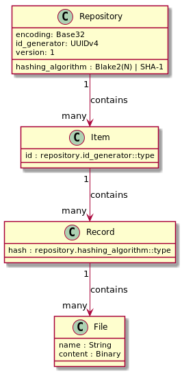

## Architecture Overview

<center>
<p align="center">

</p>
</center>

### Repository

Repository is a collection of items. By default, such directory is called
`.sit` and is found by the tooling by scanning the working directory and upwards
until such directory is found.

Each repository has `config.json` file which contains its configuration.
The convention for this file is to contain all configurable items to avoid
potential breakage of behaviour if some defaults are to be changed going
forward.

One can initialize a SIT repository in their working directory using `sit init`
command. It will create `.sit` directory.

### Item

Item could be a topic or a problem for debate, discussion and resolution (aka "ticket")
and is represented by a uniquely named directory within a repository. While some
items might be named manually (might be a great way to establish some
conventions), it is generally recommended that a globally unique identifier is
generated for every new item (such as UUID, which is the default employed by
SIT)

Because of SIT's extensible nature, item can be also be used to represent a
wild variety of entities. For example, a Kanban board with its records
representing movement of other items into, across and out of the board; as well
as accounts, documents with annotations and other types tracked items.

Each item is comprised of zero or more records (although items with zero
records aren't very practical).

You can view, create and comment on items by launching `sit-web` (`./target/release/sit-web`)
and exploring the [Web UI](http://localhost:8080).

You can also create a new item using `sit item` command and you can list IDs
of all items using `sit items**.

#### Listing items

**NB**: This section is using the "plumbing" command line interface. It helps with
understanding how SIT works but ultimately most common interactive workflows should be
done using `sit-web` (such as one for issue tracking):

<center>
<p align="center">

</p>
</center>

By default, `sit items` will list all items by their IDs. However,
this is hardly practical if you just want to see a list of items you want to be able
to process quickly, or if you want to search for specific kinds of items.

Luckily, sit integrates [JMESPath](http://jmespath.org) filter and querying. This allows
us to achieve a lot.

For example, we can list all items with their ID and summary using processing query (`--query/-q`):

```
$ sit items -q "join(' | ', [id, summary])"
a59dfc1e-cf88-4c18-a728-23baab41f7d2 | Problem: no way to discuss items
efc6b084-db52-4d20-80b9-20112f679660 | Problem: sit requires to specify authorship
885a8af0-22ff-455c-89a6-68a13597dd53 | Problem: SIT is not very ergonomic for day-to-day use
6913711b-34ab-471f-9e83-77a719e0697a | Problem: no record authorship preserved
09274126-7d3c-4a32-9338-a5501e1bfb84 | Problem: item state does not account for unauthorized editing
```

(The above output is just an example so that you can see what it can produce)

If you want to filter out closed items, a filtering query (`--filter/-f`) will come in handy:

```
$ sit items -f "state != 'closed'" -q "join(' | ', [id, summary])"
```

You can list items in their entirety as well:

```
$ sit items -q @
```

But of course, this is not ideal as you'd have to remember and re-type
specific queries or filters to address your needs. For this, named filters
and queries should be used.

They can be defined either per SIT-repository, or in sit config. In repository,
filters they are defined with files named `.items/filters/NAME`, and
queries are defined with files named `.items/queries/NAME. Their content
should be the expression to be evaluated.

If you want to define filters or queries in your sit config instead (so it is local
to you, but not shared with other SIT repository users), you can
specify them in `items.filters` and `items.queries` properties:

```json

{
 "items": {
    "queries": {
       "overview": "join(' | ', [id, summary])"
    },
    "filters": {
       "not-closed": "state != 'closed'"
    }
 }
}
```

These queries can be used with the `--named-query/-Q` flag and filters
with `--named-filter/-F` flag.

#### Open an item

**NB**: This section is using the "plumbing" command line interface. It helps with
understanding how SIT works but ultimately most common interactive workflows should be
done using `sit-web`.

1. Run `sit item`, note the ID generated by it
2. Edit temporary `text` file to prepare a **one-line summary (title) only**.
   It is important to name the file `text` and not something else.
   Within SIT project we kindly request to use the "problem statement"
   summary as in: `Problem: something doesn't work` whenever possible.
3. Take ID from the first step and run `sit record -t SummaryChanged <id> text`
4. Edit temporary `text` file to prepare details.
   Provide detailed information for your item so that others can fully
   understand it. It is a good etiquette to have one or a few paragraphs.
5. Take ID from the first step and run `sit record -t DetailsChanged <id> text`
6. You can check if everything is correct by running `sit reduce <id>`.
   It will show the current state of the item as a JSON.

#### Comment on an item

**NB**: This section is using the "plumbing" command line interface. It helps with
understanding how SIT works but ultimately most common interactive workflows should be
done using `sit-web`.

1. Edit a temporary `text` file to prepare your comment.
   It is important to name the file `text` and not something else.
2. Take ID of your item and run `sit record -t Commented <id> text`

#### Send it to upstream

Now, this is something Web UI (at least currently) is not capable of doing as (similarly to
sit's core technology) it is made SCM-agnostic.

Now that your item is recorded locally, you can send it to this repository:

1. Create a branch (as a convention, you can use your item ID as a branch name)
2. Add new files in `.sit` and commit them. Commit message can be simply "Added item ISSUE-ID"
   or, say, "Commented on item ISSUE-ID"
3. Push it out to the inbox: `GIT_SSH_COMMAND="ssh -i sit-inbox" git push git@git.sit-it.org:sit-it/sit-inbox.git <branch>`
4. If the commit only contains new records (nothing else permitted!) the inbox
   will accept the push and immediately push it out to sit's master repository on GitHub.
   Otherwise, the push will be rejected.

To further simplify the process of sending records to the upstream,
it's highly recommended to add a remote (such as `items`) for `git@git.sit-it.org:sit-it/sit-inbox.git`
and add this to your `~/.ssh/config`:

```
host git.sit-it.org
  HostName git.sit-it.org
  IdentityFile /path/to/sit/repo/sit-inbox
  User git
```

This way, pushing out, will be as nice as `git push items <branch>`

### Record

Record is an immutable collection of files. Record is identified by a
deterministic hash of its content (for each file, hash relative file name and
then hash its content to get a cumulative hash). A record is typically linked to
a previous record via previous record's hash, unless this record is considered
to be one of the first records.

Record is used to represent an "event" that is applied to its container. For
example, a record might represent changing an item's title, stating a problem
or adding an attachment (or just about anything else). By convention, `.type/TYPE`
file within a record is used to describe the type of the record. Multiple types
are allowed to describe the same record from different perspectives (could be
a generic item description submission, such as `.type/DescriptionChanged`,
and can also be seen as a problem statement, for example, `.type/ProblemStated`)

A record is represented by a directory named after its deterministic hash (by
default, Base32-encoded), with the content hashed inside of this record.

A record is typically linked to a previous record via previous record's hash,
unless this record is considered to be one of the first records. A record can be
linked to more than one previous record, effectively "joining" them.
These links are represented by empty `.prev/[previous-record-id]` files.

This allows to establish non-exclusive ordering of records and allow records to
be prepared independently without having to synchronize their naming (for
example, in a fork or over email). By convention, if there is more than one of
the last records, when a new record needs to be added, it is appended to all of
them.

Below you can see an artificial example that shows ordering of records:

<center>
<p align="center">

</p>
</center>

(Here `H5JFAN2QSAPYX34SGTK66YFUTFS55V2` is the first record and `56AGOFFETK2KFQP2FX5OF5B2RULCAUB2`
is the last one and it "joins" `ORV3F2MEBQEDHIM4A6ATLQJKQ7OMEMT6` and `ORV3F2MEBQEDHIM4A6ATLQJKQ7OMEMT6`)

This approach allows us to preserve the totality of the changes occured, without
having to rely on SCM capabilities. That's right, even if one is to lose the
actual repository, but to keep the source code tree, nothing will be lost on
SIT's side. The directory layout described is chosen in favour of plain text
append-only files for two reasons:

1. It's far more merge-friendly (one wouldn't incur merge conflicts)
2. It's an easier mechanism for managing record's supplemental files (no need to both include files and list them in
   a file, just including a file is sufficient)

Below is the list of some record files conventions:

| Filename   | Description                                                                                                        | Notes                                                                                                |
|------------|--------------------------------------------------------------------------------------------------------------------|------------------------------------------------------------------------------------------------------|
| .type/TYPE | Record type. Open-ended, unknown types must be ignored.                                                            | Required, more than one entry is allowed. Case-insensitive to allow for case-insensitive filesystems |
| .prev/ID   | Link to a previous record ID.                                                                                      | Optional, more than one entry is allowed                                                             |
| .timestamp | ISO-8601 timestamp, always with zero UTF offset (`YYYY-MM-DDTHH:mm:ss.sssZ`).                                      | Optional but generally encouraged                                                                    |
| .authors   | List of record authors (one per line, `John Doe <john@doe>` format is recommended, `John Doe` is also acceptable ) | Recommended                                                                                          |
| .signature | ASCII PGP signature of the encoded hash of the record without this file (`gpg --sign --armor`)                     | Recommended                                                                                          |

You can create a record using `sit record <item id> [FILE]..` command.

### Reducers

Reducer is a very important concept in SIT. By themselves, records are cool but of little
practical value as they don't allow us to observe the current state of any item but
only its history.

The naming comes from [fold, or reduce function](https://en.wikipedia.org/wiki/Fold_(higher-order_function))

In a nutshell, a reducer takes current state and an item to process and returns an update state:

```
Reducer(State, Item) -> State1;
```

In practicular terms, a reducer takes a state of the item (a JSON object), and a record
and returns an updated JSON object with the state of the item. In order to produce a meaningful
representation of an item, we must iterate records in order to get a valid result. One of the
interesting features here is the ability to process records up to a certain point to see how
an item looked back then.

Currently, the core dictionary processed by SIT is very small (but it is expected to grow) and
can be found in [documentation](dict).

One can look at the state of the item with the `sit reduce <item id>` command.

By default, standard reducers are added to every new SIT repository, and can be updated
from new SIT builds by running `sit populate-files`.

One can write their own reducer by putting an extra file to `.sit/reducers/FILENAME.js` and
implementing this interface:

```javascript
module.exports = function(state, record) {
  // ...
  return newState;
}
```

This function will be invoked with an object bound to `this` so that the state can be saved
across invocations, per item.

## Web UI

**Status**: fresh out of the oven, rough on the edges.

SIT features a sub-project called `sit-web` which allows to access the items over a web interface.
While it is currently quite rudimentary features-wise and has zero styling, it has been built with
local customization in mind. It's built using [Web Components](https://webcomponents.org) and
[Polymer 2.0](https://www.polymer-project.org/).

By default, it embeds all necessary files into its own binary from [sit-web/src/webapp](sit-web/src/webapp),
however, one can override ANY file by putting a replacement file into `.sit/.web/FILE/TO/BE/REPLACED`.
This file will be automatically served instead of the original one. The original files can be still accessed
by using /super/FILE/TO/BE/REPLACED path.

This tool is intended to be used by a local user over an existing repository. There's currently no
version of `sit-web` that can be hosted publicly but that'll likely change in the future.
