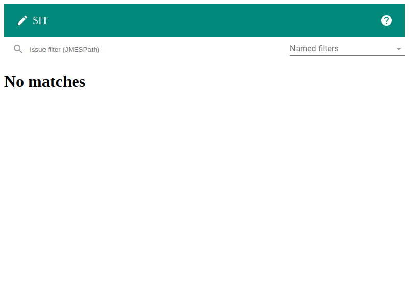
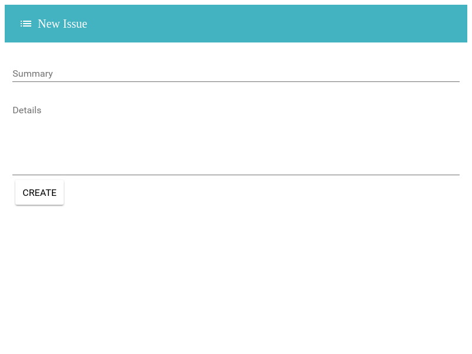
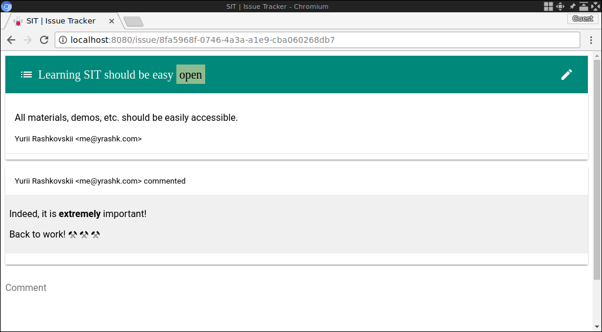
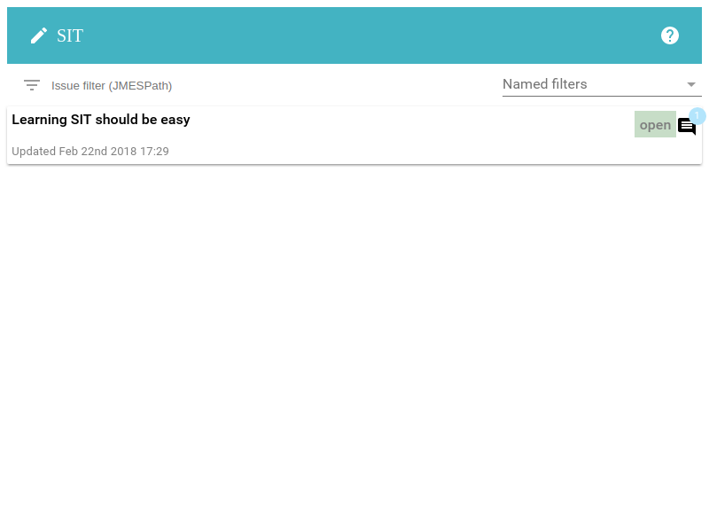
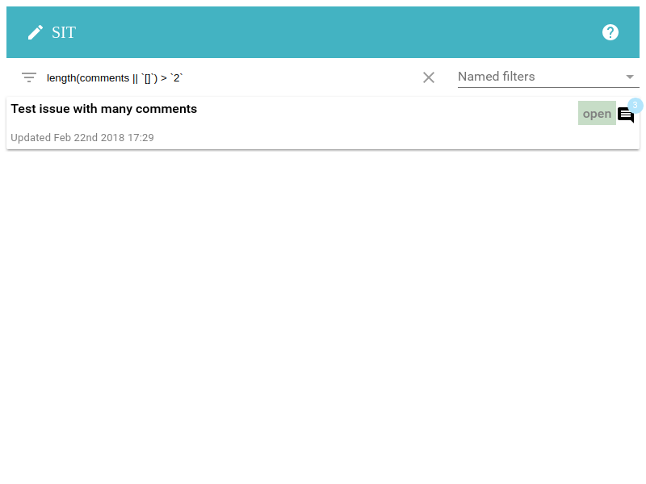

# Getting Started

We intend to guide you through the very basics of SIT
in the least intimidating way. We will not touch any
complex features or explain how it works internally. That can
be dealt with later.

Let's start!

## Obtaining SIT

All our releases are hosted on [GitHub](https://github.com/sit-it/sit/releases)
and binary files can be downloaded from there.

## (OPTIONAL) Building from the source code

As SIT is currently in its early days, sometimes
it might make sense to use a pre-release build. You
can do one yourself.

Firstly, you will need to install Rust 1.24.1. Luckily
it is typically a very simple process. You can find
instructions on [Rust's website](https://www.rust-lang.org/en-US/install.html).

Now, after that has been taken care of, time to check
out SIT and build it:

```
git clone https://github.com/sit-it/sit
cd sit
cargo build --release
```

Now, you can copy `target/release/sit` and `target/release/sit-web` to your
`PATH` or add `/path/to/target/release` to `PATH` to always have the most
recent version available.

## Preparing to use

As all the information SIT records should (ideally, at least!) contain relevant authorship information, it is important to set this up before using SIT. Create `$HOME/.config/sit/config.json` (or `%HOME%\sit_config.json` on Windows) configuration file and put something like this (with your name and, optionally, contact information):

```json
{
  "author": {
    "name": "Your Name",
    "email": "your@email"
  }
}
```

Now, we're ready to roll.

## Creating a new repository

SIT stores its artifacts in a repository, and one can be initialized
simply by running this command:

```
sit init
```

It will create `.sit` directory in your current directory. Note that if, in the
future, you'll be in any of your current directory's sub-directories, SIT will
always attempt to find this directory scanning upwards. So, for example, if you
have `/path/to/project/.sit` you can call any SIT command from directories like
`/path/to/project/component/src` and SIT will find `/path/to/project/.sit`.

Now, run `sit-web` and go to [http://localhost:8080](http://localhost:8080). You
will see an empty screen like this:



While it is not immediately useful, it's giving us the first function: creating an issue.

## Creating an issue

In the above screen, click the top-right icon and you should see the following form:



Type in what you want and hit the "Create" button. You should get something like this (the actual text should be the one you entered, of course):


As SIT's web interface is still in development, its capabilities are somewhat limited. For now, you can leave a comment, for example:



If you click on the top-left icon, you will get back to the list of issues:



## Search

SIT allows to search for issues using a very powerful [JMESPath](https://jmespath.org) query language. While the language itself and details of the documents you'd query are outside of the scope of this quick intro, the basic idea is that you enter your query in the "filter" input box.

In the example below, we're filtering for issues that have more than two comments:



## Collaboration

Issue tracking is most useful in teams. How do you collaborate with others, considering that this is a local web application we're using? 

Great question! SIT was built this way to enable truly offline-first experience and unfettered access to information. But that doesn't really mean collaborating should be particularly difficult.

The way SIT organizes its repositories allows an easy exchange of updates. It's simply files (mostly plain-text) and SIT will never overwrite existing ones, so you can simply copy the whole `.sit` directory and give it to your colleagues. They can give copies of their updated `.sit` directories back to you anytime and you can simply copy it over, skipping the overriding files (just so save a second or two).

Of course, this isn't the simplest experience, but it's the foundation for *far more convenient* ones. For example, you can simply put your `.sit` directory in Dropbox or Keybase folder and share it with others. This way, any time new files are pulled in, you will have an updated version of your repository. No conflicts. No mess. It will simply work.

SIT allows for different "deployment" strategies. SIT itself, for example, stores its `.sit` directory in its git repository, so that issues can be coupled with the revisions or branches. This way they represent the true state at any chosen revision. This is an extremely useful feature.

---

This concludes our brief tutorial. If you are interested in learning more about *how* SIT works or how to use it using command line utility or even without one (yes, that's definitely possible!), please refer to other sections of this documentation.

---

### What else does SIT have (aka "why should I care?")

Just to list a few features:

* SIT allows to define custom workflows of nearly-unlimited variety. Simply recording updates with custom types and writing simple JavaScript functions to process those allows you, for example,  to design an approval workflow or even a Kanban board.
* SIT's web interface is easily customizable and extensible. By simply overriding a file from the default implementation (by putting it into `.sit/.web/path/to/file`) you can build shared extensions to the interface. Coupled with the feature above, this creates a lot of opportunities for customization.
* SIT works with any SCM (such as Git, Mercurial or Perforce) with no merge conflicts or no SCM at all
* SIT can be used with a file synchronizer of your choice (Dropbox, Keybase or others)

There will be few more interesting coming soon as well. Stay tuned!